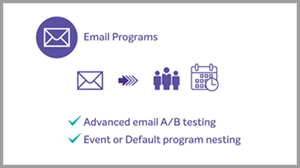

# Tutoriels [!DNL Marketo Engage]

Parcourez notre bibliothèque de tutoriels et profitez pleinement de [!DNL Marketo Engage]. Ces tutoriels peuvent vous aider à compléter la [[!DNL Marketo] documentation du produit](https://experienceleague.adobe.com/docs/marketo/using/home.html?lang=fr){target="_blank"} pour vous aider à mieux comprendre les fonctionnalités d’automatisation du marketing.

<!-- 

 -->

## Nouveautés {#whats-new}

* [Migration vers Adobe Identity Management](https://experienceleague.adobe.com/en/docs/marketo-learn/tutorials/fundamentals/migrating-to-adobe-identity-management)

_Découvrez comment naviguer dans la migration Adobe Identity Management pour commencer à gérer Adobe Marketo Engage avec d&#39;autres comptes d&#39;Adobe et produits pour vos utilisateurs dans un emplacement central._

* [Informations et actions sur des événements de webinaires interactifs passés](https://experienceleague.adobe.com/fr/docs/marketo-learn/tutorials/events/interactive-webinars-post-event-insights-and-actions)

Découvrez où trouver des informations détaillées sur les performances et l’engagement de votre événement de webinaires interactifs.

* [Marketo Comment API Vidéo - Comment définir le jeton d’accès dans une variable](https://experienceleague.adobe.com/en/docs/marketo-learn/tutorials/integrations/api-set-access-token-variable)

Découvrez comment configurer l’application Postman et comment utiliser des variables pour enregistrer des données dans la variable à des fins de réutilisation.

## Les vidéos les plus populaires {#most-popular-videos}

<table>
<tr>
<td>

<a href="https://experienceleague.adobe.com/fr/docs/marketo-learn/tutorials/programs-and-campaigns/smart-campaigns-101"><strong>Campagnes intelligentes 101</strong></a>

</td>
<td>

<a href="https://experienceleague.adobe.com/en/docs/marketo-learn/tutorials/dynamic-chat/conversational-forms"><strong> </strong></a>

</td>
<td>

<a href="https://experienceleague.adobe.com/fr/docs/marketo-learn/tutorials/fundamentals/programs-and-campaigns"><strong>Présentation des programmes et campagnes Marketo</strong></a>

</td>
</tr>
</table>
