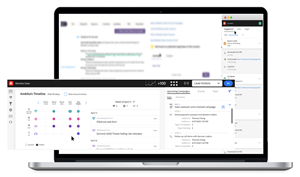

# Tutoriels sur les actions Sales Insight

Utilisez les [!UICONTROL Actions Sales Insight] pour accélérer les efforts de prospection à l’aide d’outils d’intelligence et d’engagement optimisés par le marketing, le tout dans un seul workflow.

>[!NOTE]
>
>Marketo Sales Insight Actions est une application web qui s’intègre exclusivement au CRM Salesforce via le package [Marketo Sales Insight](https://experienceleague.adobe.com/fr/docs/marketo/using/product-docs/marketo-sales-insight/msi-for-salesforce/installation/install-marketo-sales-insight-package-in-salesforce-appexchange){target="_blank"}. Il est parfois appelé « Ventes Marketo » ou simplement « Actions ».

## Tutoriels en vedette {#featured-tutorials}

<table style="table-layout:fixed">
<tr>
<td>

<a href="/help/main/sales-insight-actions/sales-insight-actions-overview.md"><strong>Présentation des actions de Sales Insight</strong></a>

</td>
<td>

<a href="/help/main/sales-insight-actions/accessing-your-sales-insight-actions-instance.md"><strong>Accès À Votre Instance D’Actions Sales Insight</strong></a>

</td>
<td>

<a href="/help/main/sales-insight-actions/configure-sales-activity-logging-to-salesforce.md"><strong>Configurer la journalisation des activités de vente sur [!DNL Salesforce]</strong></a>

</td>
</tr>
</table>

## Articles en vedette {#featured-articles}

<table style="table-layout:fixed">
<tr>
<td>

<a href="https://experienceleague.adobe.com/docs/marketo/using/product-docs/marketo-sales-insight/actions/sales-insight-actions-feature-overview.html?lang=fr"><strong>Présentation de la fonctionnalité Actions de Sales Insight</strong></a>

<em>Accélérez les efforts de prospection grâce à des outils d’engagement et d’intelligence basés sur le marketing.</em>

</td>
<td>

<a href="https://experienceleague.adobe.com/docs/marketo/using/product-docs/marketo-sales-insight/actions/getting-started/sales-insight-actions-user-onboarding-checklist.html?lang=fr"><strong>[!DNL Sales Insight Actions] Guide d’intégration des utilisateurs </strong></a>

<em>Étapes que les nouveaux utilisateurs devront suivre pour commencer.</em>

</td>
<td>

<a href="https://experienceleague.adobe.com/docs/marketo/using/product-docs/marketo-sales-insight/actions/admin/actions-data-sync-faq.html?lang=fr"><strong>FAQ sur la synchronisation des données d’Actions</strong></a>

<em>Questions fréquentes relatives au fonctionnement de la synchronisation de l’unification des données.</em>

</td>
</tr>
</table>
