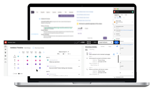
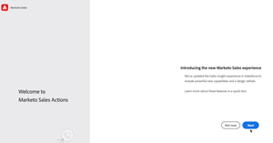
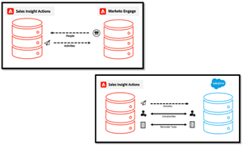

# Tutorials d’actions d’aperçu commercial

Utilisation [!UICONTROL Actions d’aperçu commercial] pour accélérer les efforts de prospection grâce à des outils d’intelligence et d’engagement optimisés par le marketing ensemble dans un seul workflow.

>[!AVAILABILITY]
>
>Cette fonctionnalité est actuellement en cours de déploiement échelonné. Contactez votre responsable du succès client ou e-mail. `sales-insights(at)adobe(dot)com` pour demander l’accès.

## Tutorials présentés {#featured-tutorials}

<table style="table-layout:fixed">
<tr>
<td>

<a href="/help/sales-insight-actions/sales-insight-actions-overview.md"><strong>Présentation des actions de Sales Insight</strong></a>

</td>
<td>

<a href="/help/sales-insight-actions/accessing-your-sales-insight-actions-instance.md"><strong>Accès à votre instance d’actions Sales Insight</strong></a>

</td>
<td>

<a href="/help/sales-insight-actions/configure-sales-activity-logging-to-salesforce.md"><strong>Configuration de la journalisation des activités de vente sur [!DNL Salesforce]</strong></a>

</td>
</tr>
</table>

## Articles présentés {#featured-articles}

<table style="table-layout:fixed">
<tr>
<td>

<a href="https://experienceleague.adobe.com/docs/marketo/using/product-docs/marketo-sales-insight/actions/sales-insight-actions-feature-overview.html"><strong>Présentation de la fonction Actions d’aperçu des ventes</strong></a>

<em>Accélérez les efforts de prospection grâce à des outils d’intelligence et d’engagement basés sur le marketing.</em>

</td>
<td>

<a href="https://experienceleague.adobe.com/docs/marketo/using/product-docs/marketo-sales-insight/actions/getting-started/sales-insight-actions-user-onboarding-guide.html"><strong>[!DNL Sales Insight Actions] Guide d’intégration des utilisateurs</strong></a>

<em>Pour commencer, les nouveaux utilisateurs doivent suivre les étapes suivantes.</em>

</td>
<td>

<a href="https://experienceleague.adobe.com/docs/marketo/using/product-docs/marketo-sales-insight/actions/admin/actions-data-sync-faq.html"><strong>FAQ sur la synchronisation des données d’actions</strong></a>

<em>Questions fréquentes sur le fonctionnement de la synchronisation de l’unification des données.</em>

</td>
</tr>
</table>

## Assistance personnalisée {#personalized-support}

Pour recevoir une assistance personnalisée pour cette fonctionnalité, veuillez [planifier un appel](https://outlook.office365.com/owa/calendar/AdobeInc1@adobe.onmicrosoft.com/bookings/) avec l’équipe produit.

## Signaler un bogue/retour {#report-a-bug-feedback}

Si vous rencontrez un bogue ou avez des commentaires généraux sur cette fonctionnalité, veuillez nous envoyer un email à l’adresse `sales-insights(at)adobe(dot)com`.
