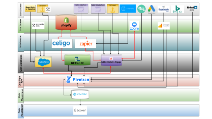

# Créer un diagramme de flux de données visuel pour comprendre votre pile de technologies marketing

En tant qu’administrateur qui prend la relève d’un [!DNL Marketo Engage] qui est en ligne depuis des années, c&#39;est comme une mission impossible à contrôler et à organiser efficacement l&#39;instance. Quand Adobe [!DNL Marketo Champion] (2019), Kelly Jo Horton, est entrée dans une instance établie de longue date, elle s&#39;est attaquée à ce défi par [création d’un diagramme &quot;Plomb et sources de données&quot;](https://nation.marketo.com/t5/employee-blogs/understand-your-marketing-technology-and-data-create-this/ba-p/296774){target="_blank"} pour se familiariser avec l&#39;univers des données. Dans ce tutoriel, vous apprendrez à créer votre propre diagramme de flux de données en vous basant sur les exemples partagés par Kelly Jo Horton. Connaissons votre écosystème MarTech !

## Pourquoi créer un diagramme d’architecture pour votre instance héritée ?

1. **Familiarisez-vous avec la pile de technologies marketing que vous avez héritée d’une instance en direct.** Tous les responsables des opérations marketing/responsables des opérations de plateforme sont encouragés à effectuer cet exercice lorsqu’ils commencent dans une nouvelle entreprise. Ce processus de création permet aux utilisateurs administrateurs d’afficher la vue d’ensemble des données et activités envoyées depuis les intégrations externes à [!DNL Marketo Engage] et pour résoudre facilement les erreurs de l’API.
2. **Familiarisez-vous avec les principales parties prenantes qui gèrent les intégrations externes.** Kelly Jo Horton utilise une astuce pour identifier rapidement les parties prenantes : référencez la liste des utilisateurs de l’API.
   1. **Accédez à l’onglet &quot;Intégration>LaunchPoint&quot; dans la section &quot;Admin&quot;.** Découvrez comment accéder à l’onglet &quot;LaunchPoint&quot; : [Créer un service personnalisé à utiliser avec l’API REST](https://experienceleague.adobe.com/docs/marketo/using/product-docs/administration/additional-integrations/create-a-custom-service-for-use-with-rest-api.html){target="_blank"}.
   2. Recherchez les statistiques d’utilisation de l’API par utilisateur de l’API dans l’onglet Intégration > Services web de la section Informations sur l’appel de l’API . En cliquant sur le numéro d’appel de l’API, vous pouvez afficher les appels individuels spécifiques effectués par chaque utilisateur.

## Comment effectuer cet exercice de diagramme de flux de données visuel

### Étape 1 : diagramme d’état actuel

Créez un diagramme &quot;Etat actuel&quot;. Voici un exemple :

{align="center"}

### Étape 2 : futur diagramme d’état

Créez un diagramme &quot;Etat de l’avenir&quot; qui peut être utilisé lors de la présentation de la feuille de route de la technologie et des systèmes aux parties prenantes non techniques. Voici un exemple :

{align="center"}

### Étape 3 : version technique

Créez une version technique qui affiche des détails tels que le nom d’utilisateur de l’API pour chaque intégration, une brève description du type de données transmises à . [!DNL Marketo Engage] ou extrait à partir de [!DNL Marketo Engage], ainsi qu’un diagramme détaillé des flux et des déclencheurs middleware.  Voici un exemple :

{align="center"}

## Et après ?

**Prise en main d’exemples :**
Téléchargez l’un des exemples de diagrammes de flux de données pour déterminer l’état actuel de votre pile de technologies marketing, de votre personne et de votre flux de données, ou créez un diagramme pour votre univers de données à partir de zéro lorsque vous audaciez l’instance :

<table style="table-layout:fixed">
   <tr>  
      <td style="border: 0;">
      

          <a href="./_assets/downloads/Current_Future_State_Lead_Data_Sources.zip">
            <strong>État actuel et futur</strong>
         </a>
      

      </td>
      <td style="border: 0;">
      

         <a href="./_assets/downloads/Detailed_Layers_by_Functional_Category_Stacked_Technologies.zip">
         <strong>Calques détaillés par catégorie fonctionnelle </strong>   
         </a>
      

      </td>
      <td style="border: 0;">
         

         <a href="./_assets/downloads/Lead_Data_Source.zip">
           <strong>Flux de piste et de source de données </strong>  
         </a>
         

       </td> 
       <td style="border: 0;">
         

         <a href="./_assets/downloads/Simple_World_Class_Stage_Stack.zip">
          <strong>Schéma simplifié</strong>  
         </a>
         

        </td>  
   </tr>
   <tr>
    <td style="border: 0;">
         

          
         </a>
      

      </td>
      <td style="border: 0;">
         

         
         

      </td>
       <td style="border: 0;">
         

            
         

      </td>
     <td style="border: 0;">
         

            
         

      </td>
</table>

Voici quelques outils que vous pouvez utiliser : draw.io (Google Docs), Adobe XD, Figma, Gliffy (in Confluence)

**Et s&#39;il y a déjà des diagrammes d&#39;architecture ?** Les nouveaux membres de l&#39;équipe pourraient avoir des perspectives différentes. Il est utile d’avoir de nouvelles [!DNL Marketo Engage] les administrateurs effectuent cet exercice dans le cadre de leur processus d’intégration et le partagent avec d’autres personnes.

## Auteurs

**Kelly Jo Horton**\
Champion Marketo Adobe (2019)
*Partenaire client senior chez Etumos*

{width="30%"}

**Amy Chiu**
*Gestionnaire marketing de l’adoption et de la rétention, Adobe*

{width=30%}
